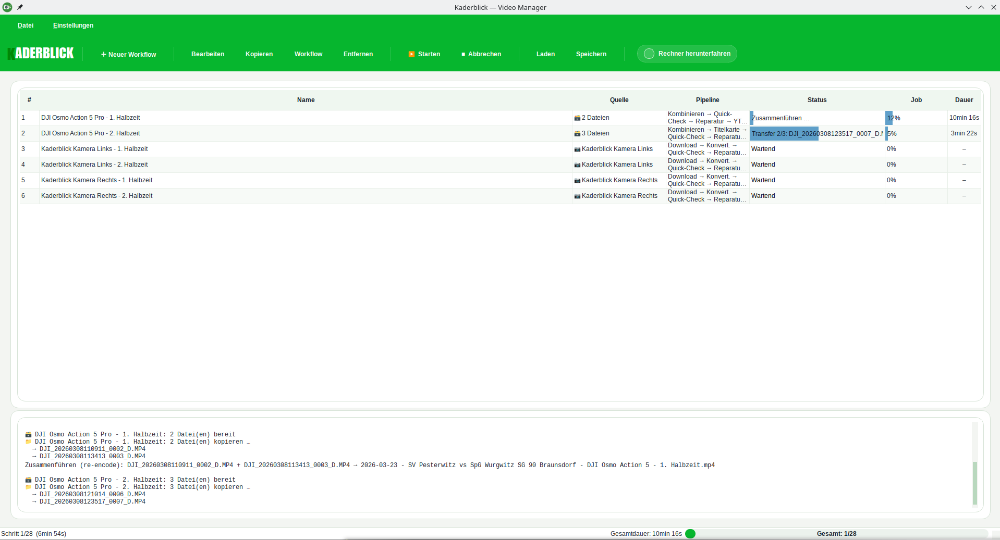

# Kaderblick — Video Manager

Grafische Oberfläche für die Video-Konvertierung und den Download von Videos von Raspberry Pi
Kamera-Systemen (Kaderblick). Unterstützt sowohl MJPEG-Rohstreams (Pi-Kameras) als auch reguläre
Video-Container (MP4, MKV, AVI, MOV) mit eingebetteter Tonspur. Bietet eine komfortable Qt-GUI
(PySide6) mit Jobliste, Profilen, GPU-Beschleunigung, Raspberry Pi Download,
Halbzeit-Zusammenführung, persistenten Einstellungen, Hintergrund-Verarbeitung und einem
**Job-Editor** für die komfortable Konfiguration einzelner Verarbeitungs-Aufträge.

<p align="center">
  
</p>

Weiterführende Doku: [YouTube API – Credentials einrichten](docs/youtube_credentials.md)

---

## Features

- **Jobliste** – Aufträge anlegen, bearbeiten, duplizieren und als Queue abarbeiten
- **Job-Editor** – Ein-Dialog-Baukasten: Quelle, Verarbeitung, Audio und YouTube in einem einzigen, scrollbaren Dialog konfigurieren; beim Anlegen stehen vorgefertigte **Pipeline-Vorlagen** zur Auswahl
- **Profile** – Vorkonfigurierte Einstellungen: *KI Auswertung*, *YouTube*, *Benutzerdefiniert*
- **Hardware-Encoding** – NVIDIA NVENC-Beschleunigung mit automatischer Erkennung und Fallback auf CPU
- **GPU-Diagnose** – Detaillierte Statusanzeige mit Lösungsvorschlägen bei Problemen
- **Raspberry Pi Download** – Videos direkt von angebundenen Kamera-Systemen herunterladen (rsync mit nativem SSH, SFTP als Fallback)
- **Halbzeiten zusammenführen** – Automatische Erkennung und Zusammenführung mit Titelkarten
- **Einstellungs-Dialoge** – Video, Audio und YouTube werden in separaten Dialogen konfiguriert
- **Persistente Einstellungen** – Alle Settings werden in `data/settings.json` gespeichert
- **Hintergrund-Verarbeitung** – ffmpeg läuft in einem Worker-Thread, die GUI bleibt bedienbar
- **Fortschrittsanzeige** – Statusbar mit Fortschrittsbalken, Geschwindigkeit (MB/s) und ETA-Anzeige
- **Resume-Unterstützung** – Abgebrochene Downloads werden beim nächsten Start automatisch fortgesetzt
- **Protokoll** – Scrollbares Log mit detaillierten Meldungen
- **Abbruch-Funktion** – Laufende Konvertierungen oder Downloads abbrechen
- **YouTube-Upload** – Automatischer Upload mit Playlist-Verwaltung (Playlist wird bei Bedarf angelegt)
- **Download → Konvertierung → Upload** – Durchgängige Pipeline: Pi-Downloads, Konvertierung und YouTube-Upload in einem Durchlauf
- **Container-Unterstützung** – Neben MJPEG-Rohstreams auch MP4/MKV/AVI/MOV mit eingebetteter Tonspur. Leise Aufnahmen können direkt verstärkt werden (konfigurierbar in dB)

---

## Voraussetzungen

- **Python** ≥ 3.11
- **ffmpeg** und **ffprobe** (für die Video-Konvertierung)
- *Optional:* **NVIDIA-GPU** mit Treiber ≥ 550.54 für Hardware-Encoding (NVENC)
- *Optional:* SSH-Zugang zu den Raspberry Pi Kameras (für den Download)
- *Optional:* **rsync** – wird als primäre Transfermethode genutzt (hardware-beschleunigte AES-NI, ~100 MB/s auf 1 Gbit)
- *Optional:* **sshpass** – wird für rsync mit Passwort-Auth benötigt (`sudo apt install sshpass`)

---

## Installation

```bash
# 1. Virtual Environment erstellen (falls noch nicht vorhanden)
python3 -m venv .venv
source .venv/bin/activate

# 2. Abhängigkeiten installieren
pip install -r requirements.txt
```

### ffmpeg installieren

```bash
# Debian / Ubuntu
sudo apt install ffmpeg

# Arch
sudo pacman -S ffmpeg
```

---

## Starten

```bash
python main.py
```

### Kommandozeilen-Optionen

| Option | Beschreibung |
|---|---|
| `--workflow PFAD` | Lädt eine Workflow-JSON-Datei und führt sie nach dem Start automatisch aus. |
| `--add DATEI [DATEI …]` | Fügt die angegebenen Dateien (oder alle Dateien in Ordnern) beim Start in die Jobliste ein. |
| `--restore-last-workflow` | Erzwingt die Wiederherstellung des zuletzt gespeicherten Workflows (unabhängig von der Einstellung). |
| `--no-restore-last-workflow` | Unterdrückt die Wiederherstellung des zuletzt gespeicherten Workflows. |
| `-h`, `--help` | Zeigt die Hilfe mit allen Optionen an. |

**Beispiele:**

```bash
# Workflow direkt aus der Kommandozeile laden und starten
python main.py --workflow workflows/spieltag.json

# Letzten Workflow explizit wiederherstellen
python main.py --restore-last-workflow

# Dateien vorladen
python main.py --add /pfad/zu/video1.mjpg /pfad/zu/video2.mjpeg
```

---

## Projektstruktur

```
projekt-root/
├── README.md                       <- Diese Datei
├── config/                         <- Konfigurationsdateien
│   ├── settings.json               <- Persistente App- und Kamera-Einstellungen
│   └── client_secret.json          <- YouTube OAuth (manuell, nicht im Git)
├── data/                           <- Laufzeitdaten (automatisch erzeugt)
│   ├── last_workflow.json          <- Letzter Workflow-Zustand für Wiederherstellung
│   ├── integration_state.json      <- Upload-Register und Metadaten-Historie
│   └── youtube_token.json          <- YouTube OAuth-Token (automatisch)
├── workflows/                      <- Manuell gespeicherte Workflow-Dateien (JSON)
├── docs/
│   └── youtube_credentials.md      <- Doku: YouTube-API-Setup
├── main.py                         <- GUI-Einstiegspunkt
├── src/                            <- Anwendungspaket
│   ├── __init__.py
│   └── ...
│   └── youtube.py                  <- YouTube-Upload und OAuth
└── requirements.txt                <- Python-Abhängigkeiten
```

---

## Benutzeroberfläche

### Hauptfenster

```
+-----------------------------------------------------------------+
|  Menü: Datei | Einstellungen                                    |
+-----------------------------------------------------------------+
|  Toolbar: [＋ Auftrag] [＋ Alle Kameras]                        |
|           [Bearbeiten] [Duplizieren] [Entfernen]               |
|           [▶ Starten] [■ Abbrechen]                            |
|           [Laden] [Speichern]  ☐ Rechner herunterfahren        |
+-----------------------------------------------------------------+
|  Auftragsliste                                                  |
|  #  | Typ            | Beschreibung          | Status | YT-Titel|
|  1  | ⬇ Download     | Kamera1  →  /ziel/    | Wartend| Spiel1  |
|  2  | ⬇ Download     | Kamera2  →  /ziel/    | Wartend| Spiel1  |
|  3  | 🔄 Konvertieren | aufnahme_1.mjpg       | ████65%|         |
|  4  | 🔄 Konvertieren | aufnahme_2.mjpg       | Fertig | Spiel2  |
+-----------------------------------------------------------------+
|  Protokoll (scrollbares Log)                                    |
|  ⬇ Download von 2 Kamera(s)  →  /ziel/                         |
|  === [1/2] aufnahme_1.mjpg ===                                  |
|  Encoder: h264_nvenc (NVIDIA GPU)                               |
|  Fertig: aufnahme_1.mp4 (234 MB, 45s)                          |
+-----------------------------------------------------------------+
|  Statusbar  [████████░░░░] 2/3  ETA 12s                        |
+-----------------------------------------------------------------+
```

### Toolbar-Buttons

| Button | Funktion |
|--------|----------|
| **＋ Auftrag** | Öffnet den Job-Editor zum Anlegen eines neuen Auftrags |
| **＋ Alle Kameras** | Legt für alle konfigurierten Pi-Kameras sofort je einen Download+Konvertierungs-Auftrag an |
| **Bearbeiten** | Öffnet den Job-Editor für den ausgewählten Auftrag |
| **Duplizieren** | Erstellt eine Kopie des ausgewählten Auftrags |
| **Entfernen** | Entfernt ausgewählte Aufträge aus der Liste (Mehrfachauswahl möglich) |
| **▶ Starten** | Startet die gesamte Pipeline (Downloads → Konvertierung → Upload) |
| **■ Abbrechen** | Bricht laufende Verarbeitung ab |
| **Laden** | Lädt eine gespeicherte Workflow-JSON-Datei in die Auftragsliste |
| **Speichern** | Speichert die aktuelle Auftragsliste als Workflow-JSON-Datei |
| **Rechner herunterfahren** | System-Shutdown nach Abschluss aller Aufträge |

> **Tipp:** Aufträge können auch über **Datei → Alle Aufträge entfernen** komplett gelöscht werden.

### Menü

| Menü | Eintrag | Funktion |
|------|---------|----------|
| Datei | Workflow laden … (Strg+I) | Workflow-JSON laden und Aufträge in die Liste einfügen |
| Datei | Workflow speichern … (Strg+E) | Aktuelle Auftragsliste als Workflow-JSON speichern |
| Datei | Alle Aufträge entfernen | Auftragsliste leeren |
| Datei | Beenden | Anwendung beenden |
| Einstellungen | Video … | Video-Kodierung konfigurieren |
| Einstellungen | Audio … | Audio-Verarbeitung konfigurieren |
| Einstellungen | YouTube … | YouTube-Upload konfigurieren |
| Einstellungen | Kameras … | Raspberry Pi Geräte verwalten |
| Einstellungen | Allgemein … | Session-Wiederherstellung und allgemeine Optionen |

---

## Raspberry Pi Download

Pi-Kamera-Downloads werden als Aufträge über den **Job-Editor** angelegt:

- **＋ Auftrag** → Quellmodus *Pi-Kamera herunterladen* → Kamera wählen und Pipeline konfigurieren
- **＋ Alle Kameras** → legt für jede konfigurierte Kamera sofort einen fertig konfigurierten Auftrag an

### Kamera-Konfiguration

Geräte werden über **Einstellungen → Kameras** verwaltet. Dort können Geräte angelegt, bearbeitet
und gelöscht werden.

Jedes Gerät benötigt:

| Feld | Beschreibung |
|------|-------------|
| **Name** | Anzeigename; wird als Unterordner im Zielverzeichnis verwendet |
| **IP** | IP-Adresse des Raspberry Pi |
| **Port** | SSH-Port (Standard: 22) |
| **Benutzername** | SSH-Benutzername |
| **Passwort** | SSH-Passwort (optional, wenn SSH-Key gesetzt) |
| **SSH-Key** | Pfad zum privaten SSH-Key (optional) |

Zusätzlich werden in den Kamera-Einstellungen **Quellverzeichnis** (auf den Pis) und
**Zielverzeichnis** (lokal) sowie die Option **Nach Download löschen** konfiguriert.

### Download-Workflow

1. **＋ Auftrag** (oder **＋ Alle Kameras**) → Kamera-Auftrag in der Auftragsliste anlegen
2. Auftrag **bearbeiten** → YouTube-Titel, Playlist und Verarbeitungsoptionen setzen
3. **▶ Starten** → Downloads laufen, anschließend werden automatisch Konvertier-Aufträge erzeugt
4. Konvertier-Aufträge **erben** YouTube-Titel und Playlist vom zugehörigen Download-Auftrag
5. Konvertierung und ggf. YouTube-Upload laufen automatisch durch

### Download-Verhalten

- Es werden nur **vollständige Aufnahmen** heruntergeladen (`.mjpg` **und** `.wav` müssen vorhanden sein)
- Bereits vorhandene Dateien werden per **Größenvergleich** geprüft und ggf. übersprungen
- **Resume:** Abgebrochene Downloads werden beim nächsten Start automatisch fortgesetzt (partielle Dateien bleiben erhalten)
- Fehler bei einem Gerät unterbrechen **nicht** den Download der anderen Geräte
- Jede Kamera erhält einen eigenen Unterordner (`<Ziel>/<Kameraname>/`)

### Transfermethode

| Methode | Bedingung | Geschwindigkeit |
|---------|-----------|----------------|
| **rsync** (bevorzugt) | `rsync` installiert; bei Passwort-Auth zusätzlich `sshpass` | ~100–110 MB/s (1 Gbit) |
| **SFTP** (Fallback) | Automatisch, wenn rsync nicht verfügbar | ~14–50 MB/s |

rsync nutzt den **nativen SSH-Client** mit hardware-beschleunigter AES-NI Verschlüsselung und
bietet eingebautes Resume (`--append --partial --inplace`). Die gewählte Transfermethode wird im
Protokoll angezeigt.

> **Empfehlung:** Für große Dateien (> 10 GB) `rsync` und `sshpass` installieren:
> ```bash
> sudo apt install rsync sshpass
> ```

---

## Menü: Einstellungen

### Einstellungen → Video

Steuert die Video-Kodierung. Am oberen Rand des Dialogs befindet sich die **Profil-Auswahl** und die **GPU-Statusanzeige**.

#### Profile

| Profil | Beschreibung |
|--------|--------------|
| **KI Auswertung** | CRF 12, Preset slow – hohe Qualität für Spielanalyse mit 5–8x Zoom |
| **YouTube** | CRF 23, Preset medium – optimiert für YouTube-Upload |
| **Benutzerdefiniert** | Alle Werte frei einstellbar |

#### Encoder / GPU-Beschleunigung

| Einstellung | Standard | Beschreibung |
|-------------|----------|--------------|
| **Encoder** | auto | `auto` = beste verfügbare Option, `h264_nvenc` = NVIDIA GPU, `libx264` = CPU |

Bei `auto` wird beim Start automatisch geprüft, ob NVENC verfügbar ist. Bei Problemen erfolgt
Fallback auf `libx264` mit Hinweis im Protokoll.

#### GPU-Statusanzeige

- 🟢 **GPU bereit** – NVENC ist verfügbar und funktionsfähig
- 🔴 **GPU nicht verfügbar** – mit Erklärung und Lösungsvorschlag im Tooltip

Die Diagnose prüft in vier Schritten: GPU vorhanden? → Treiber ≥ 550.54? → ffmpeg mit NVENC? → Test-Encode erfolgreich?

#### Video-Einstellungen

| Einstellung | Standard | Beschreibung |
|-------------|----------|--------------|
| **Framerate (FPS)** | 25 | Framerate der Eingabedatei |
| **Ausgabeformat** | mp4 | `mp4` (H.264) oder `avi` (MJPEG) |
| **CRF (Qualität)** | 18 | 0=verlustfrei · 18=sehr gut · 23=Standard · 51=schlechteste |
| **Preset** | medium | ffmpeg-Preset (ultrafast … veryslow). Langsamer = kleinere Datei |
| **Verlustfrei** | aus | Aktiviert CRF=0 und Preset=slow |
| **Audio-Video-Sync** | aus | Korrigiert Drift durch Frame-Drops (zählt alle Frames, passt FPS an Audio-Dauer an) |
| **Überschreiben** | aus | Vorhandene Ausgabedateien überschreiben |

> **Tipp:** Für Spielanalyse mit bis zu 8x Zoom empfiehlt sich CRF ≤ 18 oder das Profil *KI Auswertung*.

#### Audio-Video-Sync (Frame-Drop-Korrektur)

MJPEG-Aufnahmen können durch Frame-Drops weniger Frames enthalten als erwartet. Mit fester Framerate
entsteht eine zunehmende Desynchronisation mit der Audio-Spur. Bei aktiviertem **Audio-Video-Sync**
wird die MJPEG-Datei vorab komplett gelesen, alle JPEG-SOI-Marker gezählt und die Input-Framerate
so angepasst, dass Video-Dauer = Audio-Dauer.

- Bei einer 222 GB-Datei dauert der Scan ca. 10–25 Minuten (I/O-bound)
- Fortschritt wird im Protokoll angezeigt (alle 10%)
- Hat keinen Effekt, wenn kein Audio vorhanden oder keine Abweichung erkannt wird

#### Halbzeiten zusammenführen

| Einstellung | Standard | Beschreibung |
|-------------|----------|--------------|
| **Halbzeiten zusammenführen** | aus | Erkennt zusammengehörige Halbzeiten und fügt sie zusammen |
| **Titelkarten-Dauer** | 3 s | Dauer der Titelkarte zwischen den Halbzeiten |
| **Hintergrundfarbe** | #000000 | Hintergrund der Titelkarte |
| **Textfarbe** | #FFFFFF | Textfarbe der Titelkarte |

### Einstellungen → Audio

| Einstellung | Standard | Beschreibung |
|-------------|----------|--------------|
| **Audio einbinden** | an | Ob die WAV-Datei eingebunden werden soll |
| **Audio verstärken** | an | Wendet volume + loudnorm Filterchain an |
| **Verstärkung** | 6.0 dB | Verstärkung in Dezibel (+6 dB ≈ doppelte Lautstärke, 0 = unverändert). Anschließend wird loudnorm (EBU R128) angewendet |
| **Audio-Suffix** | _(leer)_ | Suffix für alternative WAV-Dateien (z. B. `_normalized`) |
| **Audio-Bitrate** | 192k | AAC-Bitrate (96k, 128k, 192k, 256k, 320k) |

Wenn die WAV-Datei einen abweichenden Namen hat: MJPG `aufnahme.mjpg` + Suffix `_norm` → sucht `aufnahme_norm.wav`.

> **Eingebettete Tonspur:** Bei Videodateien mit bereits enthaltener Audiospur (z. B. MP4, MKV)
wird keine externe WAV-Datei benötigt. Die eingebettete Tonspur wird automatisch erkannt und
kann mit dem konfigurierbaren dB-Wert verstärkt werden. Ohne Verstärkung wird die Audiospur
1:1 übernommen (`-c:a copy`).

### Einstellungen → YouTube

| Einstellung | Standard | Beschreibung |
|-------------|----------|--------------|
| **YouTube-Version erstellen** | aus | Erstellt zusätzlich eine `*_youtube.mp4` |
| **CRF** | 23 | Qualität der YouTube-Version |
| **Max. Bitrate** | 8M | Maximale Bitrate |
| **Buffer-Größe** | 16M | VBV-Buffergröße |
| **Audio-Bitrate** | 128k | AAC-Bitrate der YouTube-Version |
| **YouTube hochladen** | aus | Upload auf YouTube (erfordert [API-Credentials](docs/youtube_credentials.md)) |

---

## Job-Editor

Über **＋ Auftrag** in der Toolbar oder per Doppelklick auf einen vorhandenen Auftrag öffnet sich
der **Job-Editor-Dialog**. Er fasst Quelle, Verarbeitung, Audio und YouTube in einem einzigen,
scrollbaren Dialog zusammen.

### Pipeline-Vorlage

Beim Anlegen eines neuen Auftrags erscheint oben eine **Pipeline-Vorlage**-Auswahl. Die gewählte
Vorlage befüllt alle Felder automatisch; anschließend kann alles frei angepasst werden:

| Vorlage | Beschreibung |
|---------|-------------|
| **Benutzerdefiniert** | Leeres Formular, alle Felder frei konfigurierbar |
| **Pi-Kamera → Konvertieren** | Download von Raspberry Pi + Konvertierung |
| **Pi-Kamera → Konvertieren → YouTube** | Download + Konvertierung + YouTube-Upload |
| **Ordner → Konvertieren** | Alle Dateien eines Ordners konvertieren |
| **Ordner → Konvertieren → YouTube** | Ordner konvertieren + YouTube-Upload |
| **Dateien → YouTube hochladen** | Fertige Dateien direkt hochladen |
| **Dateien → Konvertieren → YouTube** | Dateien konvertieren + YouTube-Upload |

### Abschnitt: Quelle

| Quellmodus | Beschreibung |
|------------|-------------|
| **Dateien auswählen** | Einzelne Videodateien direkt auswählen; jede Datei kann eigenen YT-Titel und Playlist erhalten |
| **Ordner scannen** | Alle Dateien eines Ordners mit passendem Glob-Muster verarbeiten; optionaler Zielordner, Ausgabe-Präfix und Verschieben-Option |
| **Pi-Kamera herunterladen** | Aufnahmen einer konfigurierten Raspberry-Pi-Kamera per rsync/SSH herunterladen und verarbeiten |

### Abschnitt: Verarbeitung

Kann komplett deaktiviert werden (z. B. für reinen YouTube-Upload ohne Neu-Kodierung).

| Einstellung | Beschreibung |
|-------------|-------------|
| **Encoding aktivieren** | Schalter – deaktiviert alle Encoding-Optionen |
| **Profil-Schnellauswahl** | Buttons *KI Auswertung*, *YouTube*, *Benutzerdefiniert* – setzt Encoder, Preset, CRF und Format |
| **Encoder** | `auto`, `h264_nvenc` (NVIDIA) oder `libx264` (CPU) |
| **Preset** | ffmpeg-Preset (ultrafast … veryslow) |
| **CRF** | Qualität; 0 = verlustfrei, 18 = sehr gut, 23 = Standard |
| **FPS** | Eingabe-Framerate |
| **Format** | `mp4` oder `avi` |
| **Halbzeiten zusammenführen** | Erkennt zusammengehörige Halbzeiten und fügt sie zusammen |

### Abschnitt: Audio

| Einstellung | Beschreibung |
|-------------|-------------|
| **Audio zusammenführen** | Externe WAV-Datei in die Ausgabe einbinden (für MJPEG-Rohaufnahmen) |
| **Audio verstärken** | Verstärkung in dB + EBU R128 Loudnorm |
| **Audio-Sync** | Frame-Drop-Korrektur (MJPEG): passt Input-FPS an Audio-Dauer an |

### Abschnitt: YouTube

| Einstellung | Beschreibung |
|-------------|-------------|
| **YouTube-Version erstellen** | Zusätzlich eine `*_youtube.mp4` mit YouTube-optimierten Einstellungen erzeugen |
| **YouTube hochladen** | Datei nach der Konvertierung automatisch hochladen |
| **Titel** | YouTube-Videotitel (max. 100 Zeichen) |
| **Playlist** | Name der Ziel-Playlist (wird automatisch angelegt, falls nicht vorhanden) |

---

## Workflow laden / speichern

Die gesamte Auftragsliste kann als JSON-Datei gespeichert und wieder geladen werden:

- **Datei → Workflow speichern … (Strg+E)** – Speichert alle aktuellen Aufträge in eine `.json`-Datei  
- **Datei → Workflow laden … (Strg+I)** – Lädt Aufträge aus einer `.json`-Datei
- **Toolbar: Laden / Speichern** – dieselben Funktionen direkt über die Toolbar

Gespeicherte Workflows liegen standardmäßig unter `workflows/`. So lassen sich vorbereitete
Auftragslisten teilen oder für wiederkehrende Aufgaben (z. B. Spieltag) wiederverwenden.

> **CLI:** Mit `--workflow PFAD` kann ein gespeicherter Workflow beim Start automatisch geladen und
> sofort ausgeführt werden.

---

## Session wiederherstellen

Beim Beenden der App wird die aktuelle Auftragsliste automatisch als `data/session.json` gespeichert.
Unter **Einstellungen → Allgemein** kann die Option **„Letzte Jobliste beim Start wiederherstellen"**
aktiviert werden. Dann wird beim nächsten Programmstart die gespeicherte Auftragsliste automatisch geladen.

Beim Wiederherstellen werden **unfertige Aufträge** (Status *Herunterladen*, *Heruntergeladen*, *Läuft*)
automatisch auf **Wartend** zurückgesetzt, damit sie erneut gestartet werden können.

| Datei | Beschreibung |
|-------|-----------|
| `data/session.json` | Wird beim Beenden automatisch geschrieben; enthält die Auftragsliste als JSON |

> **Tipp:** Auch ohne aktivierte Option bleibt `data/session.json` erhalten und kann jederzeit manuell
> über **Datei → Workflow laden** geladen werden.

---

## Status-Werte

| Status | Bedeutung |
|--------|-----------|
| **Wartend** | Noch nicht verarbeitet |
| **Herunterladen** | Download vom Raspberry Pi läuft |
| **Heruntergeladen** | Download abgeschlossen, Konvertierung folgt |
| **Läuft** | Wird gerade konvertiert (mit Fortschrittsbalken) |
| **Fertig** | Erfolgreich verarbeitet |
| **Übersprungen** | Ausgabedatei existiert bereits (Überschreiben deaktiviert) |
| **Fehler** | Verarbeitung fehlgeschlagen (Details im Log) |

---

## Einstellungen-Datei `data/settings.json`

Alle Einstellungen werden automatisch in `data/settings.json` gespeichert und beim Starten geladen.
Die Datei kann manuell bearbeitet werden – ungültige Werte werden durch Standardwerte ersetzt.

```json
{
  "video": {
    "fps": 25,
    "output_format": "mp4",
    "crf": 18,
    "lossless": false,
    "preset": "medium",
    "encoder": "auto",
    "profile": "Benutzerdefiniert",
    "overwrite": false,
    "audio_sync": false,
    "merge_halves": false,
    "merge_title_duration": 3,
    "merge_title_bg": "#000000",
    "merge_title_fg": "#FFFFFF"
  },
  "audio": {
    "include_audio": true,
    "amplify_audio": true,
    "amplify_db": 6.0,
    "audio_suffix": "",
    "audio_bitrate": "192k"
  },
  "youtube": {
    "create_youtube": false,
    "youtube_crf": 23,
    "youtube_maxrate": "8M",
    "youtube_bufsize": "16M",
    "youtube_audio_bitrate": "128k",
    "upload_to_youtube": false
  },
  "last_directory": "/media/videos/Aufnahmen",
  "restore_last_workflow": false
}
```

---

## Fehlerbehebung

### Allgemein

| Problem | Lösung |
|---------|--------|
| GUI startet nicht | `python3 -c "import PySide6"` testen; ggf. `pip install -r requirements.txt` |
| ffmpeg nicht gefunden | `ffmpeg -version` prüfen; installieren: `sudo apt install ffmpeg` |
| Keine WAV gefunden | WAV muss im gleichen Ordner liegen und gleichen Dateinamen haben; ggf. *Audio-Suffix* setzen |
| Konvertierung bricht ab | Details im Protokoll; häufig: zu wenig Speicherplatz oder beschädigte Eingabedatei |

### GPU / NVENC

| Problem | Lösung |
|---------|--------|
| 🔴 Keine NVIDIA-GPU gefunden | `nvidia-smi` im Terminal testen; NVIDIA-Treiber installieren |
| 🔴 Treiber zu alt | Treiber ≥ 550.54 installieren (`sudo apt install nvidia-driver-550`) |
| 🔴 ffmpeg ohne NVENC | ffmpeg mit NVENC-Support installieren |
| 🔴 Test-Encode fehlgeschlagen | Tooltip beachten; häufig: veraltete NVENC-API-Version |
| Encoder fällt auf CPU zurück | Expected Behavior bei `auto`; Hinweis erscheint im Protokoll |

### Raspberry Pi Download

| Problem | Lösung |
|---------|--------|
| Verbindung fehlgeschlagen | IP und Port in den Kamera-Einstellungen prüfen; SSH-Zugang testen: `ssh user@ip` |
| Authentifizierungsfehler | Benutzername/Passwort prüfen oder `ssh_key` eintragen |
| Keine Aufnahmen gefunden | `source`-Pfad prüfen; auf jedem Pi muss je Aufnahme `.mjpg` + `.wav` vorhanden sein |
| Download bricht ab | Partielle Dateien bleiben für Resume erhalten; beim nächsten Start wird automatisch fortgesetzt |
| Download langsam (< 50 MB/s) | `rsync` und `sshpass` installieren: `sudo apt install rsync sshpass` |
| rsync nicht genutzt trotz Installation | Bei Passwort-Auth muss auch `sshpass` installiert sein; SSH-Key empfohlen |
| SSH fragt nach Passwort | Passwort in den Kamera-Einstellungen hinterlegen oder SSH-Key konfigurieren |
